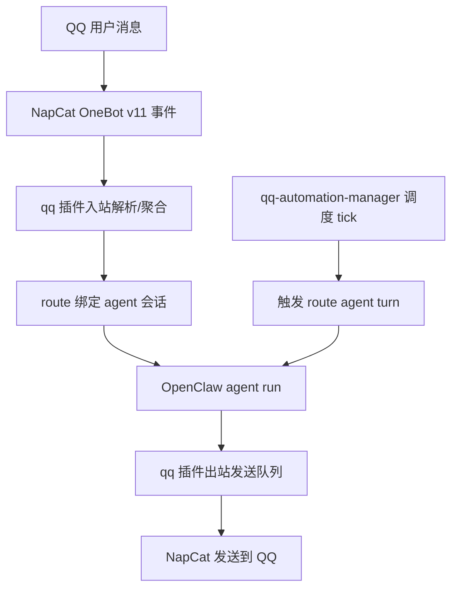

# openclaw-QQ

OpenClaw QQ 生态插件仓库（Monorepo）。

包含两个插件：
- [`packages/qq`](./packages/qq)：QQ 通道插件（OneBot v11）
- [`packages/qq-automation-manager`](./packages/qq-automation-manager)：QQ 自动化调度插件（只触发 agent，不旁路代发）

目标：
- 让 OpenClaw 在 QQ 场景可稳定收发文本/媒体
- 保证 route 会话隔离、可解释日志、可回归验证
- 支持“配置驱动自动化触达”，不破坏主会话一致性

---

## 1. 项目设计思路

### 1.1 为什么拆成两个插件
- `qq` 负责“消息通道”本身（入站、出站、媒体、会话、策略、日志）。
- `qq-automation-manager` 负责“何时触发任务”。

好处：
- 消息链路与调度链路解耦，定位问题更快。
- 自动化不会绕过通道发送，避免双轨会话。
- 升级时只需替换插件，不改 OpenClaw core。

### 1.2 核心原则
- route 是第一约束：`user:/group:/guild:` 严格隔离。
- 自动化默认 `agent-only`：只触发 run，不直接 send。
- 失败必须可解释：所有关键路径都有结构化日志。
- 配置优先：行为由 `openclaw.json` 决定，不靠隐式硬编码。

---

## 2. 版本与兼容

基线（推荐）：
- OpenClaw `>= 2026.2.26`
- NapCatQQ `v4.17.25`
- OneBot v11（Forward WebSocket）

详细矩阵见：[COMPATIBILITY.md](./COMPATIBILITY.md)

---

## 3. 功能清单

### 3.1 [`packages/qq`](./packages/qq)（通道插件）
- QQ 私聊/群聊/频道入站处理
- 入站聚合、去重、调度保护
- 文本/媒体出站统一队列 + 重试 + 抖动
- 媒体解析与 materialize（含回退链）
- route 会话隔离与 resident agent 绑定
- route 级策略/配额控制（文本/媒体/语音）
- 结构化链路日志（chat/trace/gateway）

### 3.2 [`packages/qq-automation-manager`](./packages/qq-automation-manager)（自动化插件）
- `targets[]` 配置驱动调度
- 支持 `cron/every/at`
- 触发 route 对应 agent 的 `agent turn`
- 智能触发参数（沉默窗口、活跃窗口、随机间隔）
- 自动化状态落盘与可审计

详细能力说明：[FEATURES_ZH.md](./FEATURES_ZH.md)

---

## 4. 链路流程（端到端）



关键点：
- 自动化链路进入同一 agent run，再由同一 qq 出站链路发送。
- 因此会话、策略、配额、日志完全统一。

---

## 5. NapCat 安装与配置（重点）

### 5.1 官方仓库与感谢
感谢 NapCat 社区提供稳定协议端能力：
- NapCatQQ 官方仓库：[NapNeko/NapCatQQ](https://github.com/NapNeko/NapCatQQ)
- NapCat Docker 仓库：[NapNeko/NapCat-Docker](https://github.com/NapNeko/NapCat-Docker)

### 5.2 必要 OneBot 配置
必须满足：
- 已启用 OneBot v11 WebSocket Server
- `messagePostFormat: "array"`（媒体稳定性关键）
- token 与 OpenClaw `channels.qq.accessToken` 一致

示例（核心字段）：
```json
{
  "network": {
    "websocketServers": [
      {
        "enable": true,
        "host": "127.0.0.1",
        "port": 3001,
        "messagePostFormat": "array",
        "token": "YOUR_ONEBOT_TOKEN"
      }
    ]
  }
}
```

### 5.3 Docker 场景
参考 [NapCat-Docker](https://github.com/NapNeko/NapCat-Docker)，至少暴露：
- `3001`（OneBot WS）
- `6099`（NapCat WebUI）

并持久化：
- `/app/napcat/config`
- `/app/.config/QQ`

完整步骤见：[NAPCAT_SETUP.md](./NAPCAT_SETUP.md)

---

## 6. OpenClaw 部署（人类简版）

### 6.1 安装
```bash
git clone https://github.com/xingyingyuzhui/openclaw-QQ.git
cd openclaw-QQ
bash scripts/install.sh --openclaw-home "$HOME/.openclaw" --repo-path "$PWD"
```

### 6.2 配置
将 [openclaw.example.json](./openclaw.example.json) 合并到 `${HOME}/.openclaw/openclaw.json`，至少填：
- `channels.qq.wsUrl`
- `channels.qq.accessToken`

确保：
- `plugins.allow` 包含 `qq`, `qq-automation-manager`
- `plugins.entries.qq.enabled=true`
- `plugins.entries.qq-automation-manager.enabled=true`

### 6.3 重启与验证
```bash
openclaw gateway restart
bash scripts/verify.sh --openclaw-home "$HOME/.openclaw"
```

---

## 7. OpenClaw Agent 自主部署 Runbook（无人工）

这个部分给“别人的 OpenClaw agent”直接执行。

### 7.1 输入前提
- 已有 OpenClaw 可执行命令权限
- 可访问 NapCat WS 地址
- 可写 `${OPENCLAW_HOME}/openclaw.json`

### 7.2 自动化步骤
1. 克隆仓库到工作目录。
2. 执行安装脚本：
```bash
bash scripts/install.sh --openclaw-home "$OPENCLAW_HOME" --repo-path "$REPO_PATH"
```
3. 读取并合并 [`openclaw.example.json`](./openclaw.example.json) 到目标配置。
4. 注入环境参数：
- `channels.qq.wsUrl`
- `channels.qq.accessToken`
- （可选）`channels.qq.ownerUserId`
5. 重启网关：
```bash
openclaw gateway restart
```
6. 执行验证脚本：
```bash
bash scripts/verify.sh --openclaw-home "$OPENCLAW_HOME"
```
7. 发送一条测试私聊消息，确认入站 + 出站。

### 7.3 完成判定
以下条件全部满足才算成功：
- 网关日志出现 `plugin=qq` 与 `plugin=qq-automation-manager`
- 日志出现 `[QQ] Connected to OneBot server`
- 测试消息有入站和出站记录
- route trace 日志可检索到 `qq_dispatch_done` 或 `qq_outbound_send`

### 7.4 失败回滚
- 关闭插件开关：
  - `plugins.entries.qq.enabled=false`
  - `plugins.entries.qq-automation-manager.enabled=false`
- `openclaw gateway restart`

---

## 8. 自动化目标配置（示例）

```json
{
  "plugins": {
    "entries": {
      "qq-automation-manager": {
        "enabled": true,
        "config": {
          "enabled": true,
          "strictAgentOnly": true,
          "targets": [
            {
              "id": "qq-user-123456789-daylife",
              "enabled": true,
              "route": "user:123456789",
              "executionMode": "agent-only",
              "job": {
                "type": "cron-agent-turn",
                "schedule": {
                  "kind": "cron",
                  "expr": "*/5 9-22 * * *",
                  "tz": "Asia/Shanghai"
                },
                "message": "结合近期上下文，自然发起一句简短关怀。",
                "thinking": "low",
                "timeoutSeconds": 120,
                "smart": {
                  "enabled": true,
                  "minSilenceMinutes": 30,
                  "activeConversationMinutes": 25,
                  "randomIntervalMinMinutes": 30,
                  "randomIntervalMaxMinutes": 60,
                  "maxChars": 48
                }
              }
            }
          ]
        }
      }
    }
  }
}
```

管理这个配置可用内置 skill：
- [`skills/qq-automation-admin/SKILL.md`](./skills/qq-automation-admin/SKILL.md)

---

## 9. 日志体系说明

### 9.1 三层日志
1. 网关日志：`${OPENCLAW_HOME}/logs/gateway.log`
2. 聊天日志：`${OPENCLAW_HOME}/workspace/qq_sessions/<route_key>/logs/chat-*.ndjson`
3. 追踪日志：`${OPENCLAW_HOME}/workspace/qq_sessions/<route_key>/logs/trace-*.ndjson`

### 9.2 常用事件
- `qq_inbound_received`
- `qq_inbound_media_resolve`
- `qq_inbound_media_materialize`
- `qq_dispatch_start|done|drop|timeout|error`
- `qq_outbound_send|drop|retry`
- `qq_proactive_tick|skip|send|state`

### 9.3 常用字段
- `route`, `msg_id`, `dispatch_id`, `attempt_id`, `source`
- `resolve_stage`, `resolve_action`, `materialize_error_code`
- `drop_reason`, `retry_count`, `duration_ms`

### 9.4 排障命令
```bash
rg "qq_dispatch_(drop|timeout|error)" "${OPENCLAW_HOME}/workspace/qq_sessions" -g "trace-*.ndjson"
rg "materialize_error_code|unresolvedReasons" "${OPENCLAW_HOME}/workspace/qq_sessions" -g "*.ndjson"
rg "\[QQ\]|qq-automation-manager" "${OPENCLAW_HOME}/logs/gateway.log"
```

详细事件字典：[packages/qq/LOGGING.md](./packages/qq/LOGGING.md)

---

## 10. 常见问题

1. QQ 不连通
- 检查 WS 地址、端口、token、容器网络。

2. 非文本消息不稳定
- 先确认 `messagePostFormat=array`。
- 再查 trace 的 `materialize_error_code`。

3. 自动化触发但未发送
- 看 `skip_reason`、`triggered`、`produced`、`sent_by_channel`。
- 确保 target 是 `agent-only` 且 route->agent 绑定正常。

4. 会话错位
- 确保同环境只加载一份 `qq` 插件。
- 核对 route 与 session key 是否一致。

---

## 11. 安全与升级建议

- 不要提交真实 `openclaw.json`、NapCat 登录态、会话日志。
- 升级前先做最小回归：
  - 文本私聊
  - 媒体私聊
  - 自动化一次触发
- 如果异常，先按“关闭插件开关 + 重启网关”回滚。

---

## 12. 文档索引
- 详细功能：[FEATURES_ZH.md](./FEATURES_ZH.md)
- NapCat 安装：[NAPCAT_SETUP.md](./NAPCAT_SETUP.md)
- Agent 运行指引：[AGENTS.md](./AGENTS.md)
- 兼容矩阵：[COMPATIBILITY.md](./COMPATIBILITY.md)
- 日志字典：[packages/qq/LOGGING.md](./packages/qq/LOGGING.md)
- 自动化 Skill：[skills/qq-automation-admin/SKILL.md](./skills/qq-automation-admin/SKILL.md)
- 变更记录：[CHANGELOG.md](./CHANGELOG.md)
