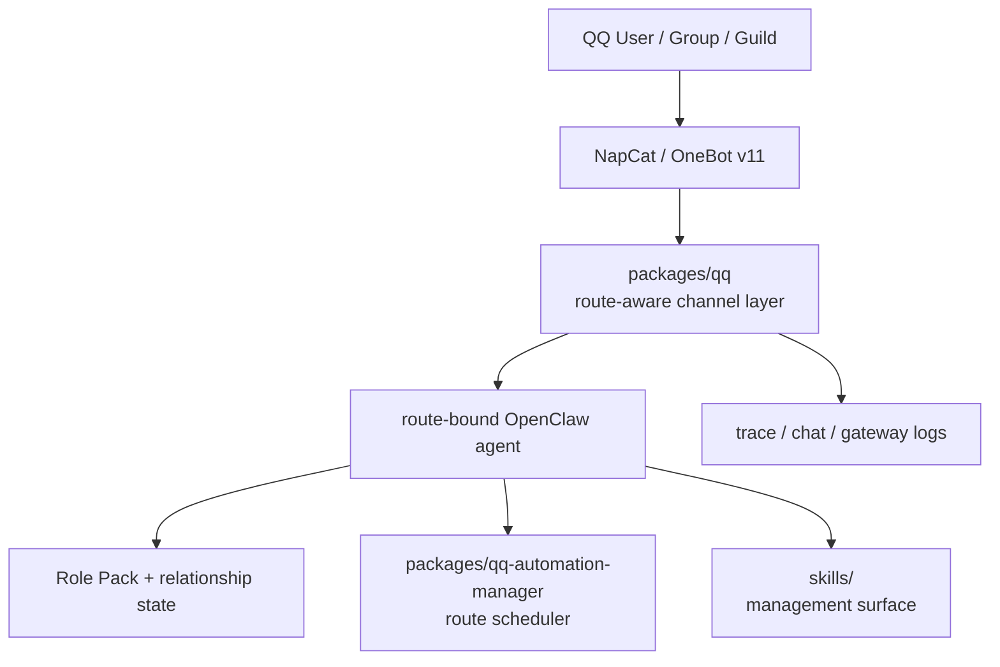

# openclaw-QQ

> A route-aware QQ channel stack for OpenClaw.
>
> 把 QQ 接入、会话绑定、角色状态、自动化和管理能力收敛到同一套运行模型里。

`openclaw-QQ` 关心的不是“把 QQ 接到大模型上”这一件小事。

它真正解决的是另一类更难、也更容易被低估的问题：
- 当一个渠道同时承载私聊、群聊、频道时，如何避免 route 串流
- 当同一个用户长期对话时，如何让 agent、session、角色状态和自动化保持一致
- 当媒体、文件、语音、自动化、权限控制都进来之后，如何不把系统写成一团不可维护的 bot 脚本

这个仓库的答案是：把 QQ 看成 OpenClaw 的一个**长期运行渠道层**，而不是一次性聊天入口。

## 为什么要这样设计

很多“QQ + LLM”方案能很快跑起来，但会在同一批地方失控：
- 消息发得出去，但 session 不稳定
- 自动化能跑，但绕过主会话
- 群聊和私聊都是数字 id，目标一猜错就串流
- 媒体链路能 work once，却不可追踪、不可回归
- 角色设定越加越多，最后全堆进 prompt，既费 token 又容易漂移

`openclaw-QQ` 的设计重点就是把这些问题系统化拆开，然后重新收敛：
- **QQ 通道插件** 负责消息、媒体、route、日志、策略、会话绑定
- **自动化插件** 负责何时触发，不旁路发送
- **Role Pack** 负责人格、风格、关系状态和 QQ 规则
- **skills** 负责把整套系统的管理能力暴露给人类和 agent

这四层共享同一套 route / agent / session 事实源，所以系统可以长期演化，而不是靠一堆 prompt patch 勉强维持。

## 这套架构带来的结果

### 1. Route 是一等公民
每个 `user:/group:/guild:` 都可以被稳定地看作一个独立的 OpenClaw 入口。

这意味着：
- route 可以绑定固定 agent
- route 有自己的会话事实源
- route 可以携带自己的 Role Pack
- route 可以被自动化安全调度

### 2. 自动化不会破坏主会话
自动化不是偷偷代发消息。

它只做 route 判定和 agent 触发，真正的发送仍回到同一条 QQ 通道出站链路。

所以：
- 角色不分裂
- 日志不分裂
- 配额不分裂
- 会话不分裂

### 3. Role Pack 不是装饰，而是运行时状态
在这套设计里，角色不是一段随手写的 prompt，而是一组结构化资产：
- persona
- style
- examples
- qq rules
- capability index
- relationship state
- preferences

这使得“角色一致性”变成系统能力，而不是运气。

### 4. 渠道能力可追踪、可测试、可升级
QQ 不是通过 scattered action strings 跑起来的。

内部已经拆成：
- NapCat transport
- typed contracts
- compatibility layer
- services
- inbound/outbound orchestration
- state registries
- structured logging

所以这个仓库更像一套渠道基础设施，而不是一个 bot 脚本集合。

## 仓库包含什么

| 组件 | 位置 | 作用 |
|---|---|---|
| QQ channel plugin | [`packages/qq`](./packages/qq) | 入站、出站、媒体、route、日志、Role Pack 集成 |
| Automation plugin | [`packages/qq-automation-manager`](./packages/qq-automation-manager) | route 级自动化触发与状态管理 |
| Role Pack runtime | `packages/qq` 内置 | 人设、风格、关系、QQ 规则、能力索引 |
| Management skills | [`skills/`](./skills) | 角色管理、关系管理、owner 管理、自动化配置 |

## Capability matrix

| Problem | qq plugin | automation manager | role pack | skills |
|---|---|---|---|---|
| route-bound agent entry | ✅ | ➖ | ➖ | ➖ |
| text / media delivery | ✅ | ➖ | ➖ | ➖ |
| schedule + smart skip | ➖ | ✅ | ✅ | ✅ |
| persona / relationship consistency | ✅ | ✅ | ✅ | ✅ |
| owner operations | ➖ | ➖ | ➖ | ✅ |
| auditability and trace logs | ✅ | ✅ | ➖ | ➖ |

## Architecture

```mermaid
flowchart TD
  A["QQ User / Group / Guild"] --> B["NapCat / OneBot v11"]
  B --> C["packages/qq\nroute-aware channel layer"]
  C --> D["route-bound OpenClaw agent"]
  D --> E["Role Pack + relationship state"]
  D --> F["packages/qq-automation-manager\nroute scheduler"]
  D --> G["skills/\nmanagement surface"]
  C --> H["trace / chat / gateway logs"]
```

## 适合谁

这套仓库适合的是：
- 已经在用 OpenClaw，希望把 QQ 变成稳定生产渠道的人
- 需要 route 绑定 agent，而不是一个全局大机器人
- 需要长期角色状态、自动化和中文管理能力的人
- 在意媒体链路、日志、可回归性和维护成本的人

如果你只是想要一个“能回消息的 QQ 机器人”，这套架构会比你需要的重。
如果你想要一个能长期运行、能继续演化的 QQ 渠道层，这套设计会更合适。

## Quick start

1. 安装 NapCat 并开启 OneBot v11 Forward WebSocket
2. 安装 [`packages/qq`](./packages/qq)
3. 安装 [`packages/qq-automation-manager`](./packages/qq-automation-manager)
4. 把 [`skills/`](./skills) 同步到 `${OPENCLAW_HOME}/workspace/skills/`
5. 合并 [`openclaw.example.json`](./openclaw.example.json)
6. 重启 gateway 并执行验证脚本

详细步骤：
- [AGENTS.md](./AGENTS.md)
- [NAPCAT_SETUP.md](./NAPCAT_SETUP.md)
- [COMPATIBILITY.md](./COMPATIBILITY.md)

## 推荐阅读顺序

### 对部署者
1. [NAPCAT_SETUP.md](./NAPCAT_SETUP.md)
2. [packages/qq/README.md](./packages/qq/README.md)
3. [packages/qq-automation-manager/README.md](./packages/qq-automation-manager/README.md)
4. [AGENTS.md](./AGENTS.md)

### 对 OpenClaw agent / 自动化安装器
1. [AGENTS.md](./AGENTS.md)
2. [openclaw.example.json](./openclaw.example.json)
3. [skills/qq-capability-index/SKILL.md](./skills/qq-capability-index/SKILL.md)
4. [skills/qq-automation-admin/SKILL.md](./skills/qq-automation-admin/SKILL.md)

## Thanks

这个仓库建立在以下项目之上：
- [OpenClaw](https://github.com/openclaw/openclaw)
- [NapCatQQ](https://github.com/NapNeko/NapCatQQ)
- [NapCat-Docker](https://github.com/NapNeko/NapCat-Docker)
- [OneBot v11](https://github.com/botuniverse/onebot-11)

感谢这些项目提供清晰边界和可靠基础能力。
